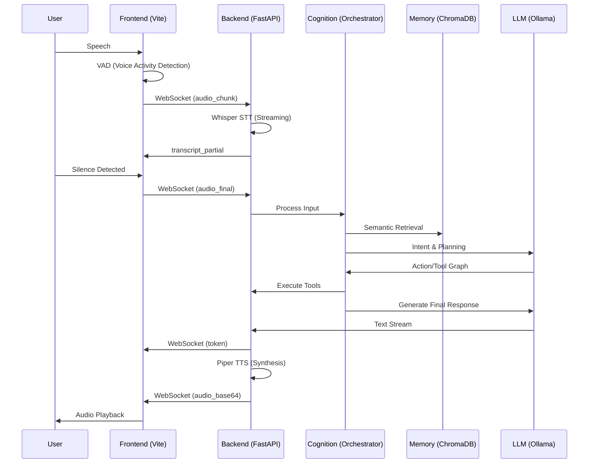

# F.R.I.D.A.Y. Runtime Flow

## 1. Conversational Pipeline (Voice-to-Voice)

## 2. Event Lifecycle
1. **`websocket_connected`**: Handshake and session initialization.
2. **`brain.thought`**: LLM starts reasoning.
3. **`brain.tool_start`**: External tool execution.
4. **`brain.tool_result`**: Data returned from tools.
5. **`websocket_disconnected`**: Cleanup and session persistence.

## 3. Resilience Mechanisms
- **Graceful Degradation**: If the reasoning graph fails, the system falls back to direct chat.
- **Auto-Reconnection**: The frontend attempts up to 5 retries if the WebSocket drops.
- **Heartbeat**: Pings every 30s to keep the connection alive.
