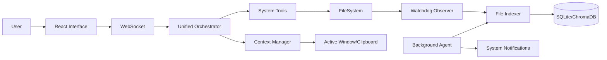

# F.R.I.D.A.Y. Desktop Agent Architecture

## Overview
The Desktop Agent Runtime (v1.5.0-Desktop) transforms F.R.I.D.A.Y. from a reactive chatbot into a proactive, workspace-aware background service. It operates as a deterministic runtime that manages filesystem intelligence, desktop context, and safe system orchestration.

## Core Modules

### 1. File Intelligence (`FileManager`)
- **Indexing Engine**: Dual-layer indexing using SQLite (relational metadata) and ChromaDB (semantic content embeddings).
- **Real-time Observer**: Uses `watchdog` to monitor filesystem events and trigger incremental re-indexing.
- **Semantic Retrieval**: Allows natural language queries like "Find my latest resume" by searching high-dimensional embeddings of document content.

### 2. Desktop Context (`ContextManager`)
- **Window Awareness**: Tracks the focused application to provide context to the LLM (e.g., "I see you're working in VS Code").
- **Clipboard Bridge**: Monitors changes to the system clipboard for immediate "Process Clipboard" actions.
- **Privacy Gate**: Enforces explicit user consent for sensitive actions like screen capture.

### 3. Background Runtime (`BackgroundAgent`)
- **Persistence**: Manages long-running tasks and scheduled objectives.
- **Heartbeat Monitoring**: Ensures system health and handles graceful recovery from service crashes.
- **Notification System**: Dispatches native OS notifications for system events and reminders.

### 4. Deterministic System Tools (`SystemTools`)
- **Allowlisted Execution**: Only verified applications and commands can be launched.
- **Audit Logging**: Every system action is logged with a timestamp and parameters for transparency.

## Data Flow

## Resilience & Stability
- **Async Safety**: All I/O operations are non-blocking or executed in dedicated thread pools to prevent UI lag.
- **Failure Fallbacks**: If the vector store is unavailable, the system degrades gracefully to standard SQL-based file search.
- **Resource Guard**: Background indexing is throttled to ensure low CPU/RAM impact during active user sessions.
