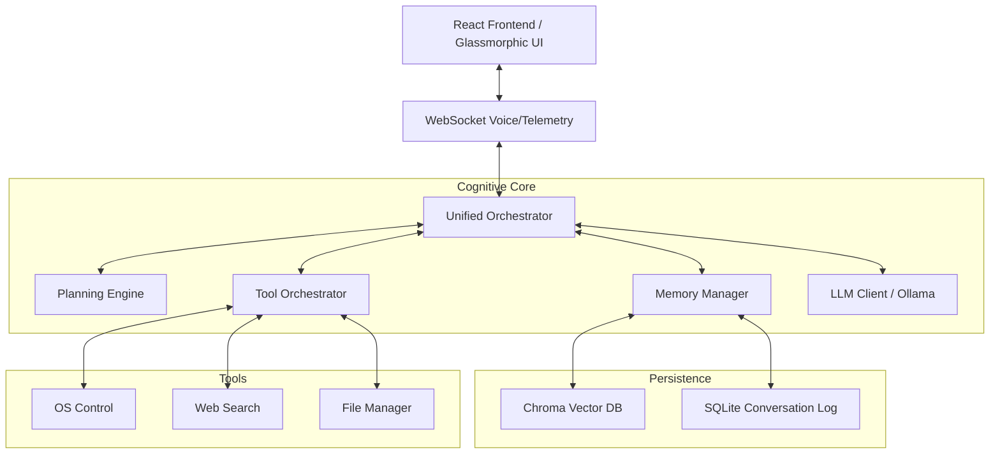

# FINAL ARCHITECTURE - F.R.I.D.A.Y. v1.5.0

## 🏗️ System Overview
F.R.I.D.A.Y. is built on a modular "Cognitive Core" architecture, separating perception, reasoning, and memory into distinct, observable layers.

## 🧠 Core Components

### 1. Unified Orchestrator
The central heartbeat of the system. It manages session locking, handles streaming concurrency, and coordinates between the Planning Engine and the LLM. It features a "Simulated Mode" for deterministic demo performance.

### 2. Planning Engine
Classifies intent complexity and determines the execution strategy (DIRECT, TOOL_ASSISTED, REASONING_GRAPH). It enforces latency budgets and ensures graceful degradation if specific modules fail.

### 3. Hierarchical Memory System
- **Short-term**: Context-aware session state.
- **Episodic**: Time-sequenced conversation history.
- **Semantic**: Long-term vector-indexed knowledge stored in ChromaDB.

### 4. Voice Pipeline
A low-latency streaming pipeline using Faster-Whisper for STT and Piper for TTS. Includes sophisticated Voice Activity Detection (VAD) and barge-in (interruption) logic.

## 🛡️ Security & Privacy
- **Local-Only**: No external API dependencies for core cognition.
- **Sanitization**: Input/Output sanitization layers prevent prompt injection and tool leakage.
- **Containerized**: Optional Docker deployment for consistent isolation.

## 📊 Observability
Integrated **Engineering Hub** provides a real-time window into the system's "thoughts," tool outputs, and network traffic, enabling sub-millisecond performance debugging.
