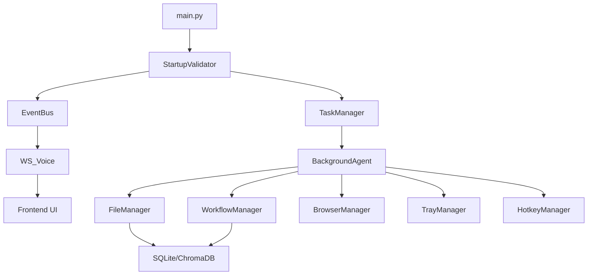

# Subsystem Dependency Graph

## Initialization Order (Startup Stability Phase 5)
1. **Core Utilities**: Logger, Settings, EventBus.
2. **Data Layers**: Database connections (WAL mode), Indexers.
3. **Control Runtime**: TaskManager, BackgroundAgent.
4. **Desktop UX**: Tray, Hotkeys (Native threads).
5. **API Interface**: FastAPI server start.
6. **Telemetry**: Active event emission.
